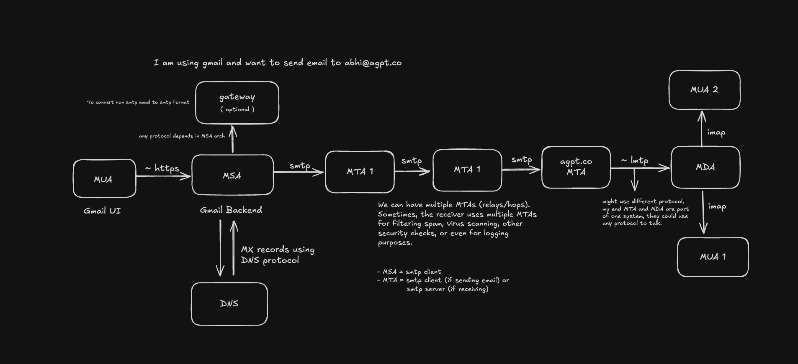

SMTP, short for Simple Mail Transfer Protocol is the Internet standard for sending email between mail servers and mail transfer agents

Here is a basic email flow - just a simple reference that does not cover all scenarios and points. You can read more about it here: https://www.geeksforgeeks.org/simple-mail-transfer-protocol-smtp/

